<!-- Ultra-Premium Animated GitHub Profile README for venusndk -->

<div align="center">



<br/>


<br/><br/>


</div>

<br/>

## ABOUT ME

I build **production-grade applications** across mobile, web, and backend with a relentless focus on **scalability**, **clean architecture**, and **exceptional user experience**.

```yaml
Name: Venuste Ndikumana
Role: Full-Stack & Mobile Developer
Focus: Flutter · React · Node.js · Firebase
Currently: Computer Science & Information Security Y4
Passionate About:
  - Real-time systems & offline-first architecture
  - Institutional & public-safety technology
  - AI-assisted engineering workflows
Open to: Product-focused engineering collaboration
```

---

## COMMIT STATISTICS

<p align="left">
  
  
</p>

<p align="left">
  
</p>

<p align="left">
  
  
</p>

---

## ENGINEERING DASHBOARD

<p align="center">
  
</p>

<p align="center">
  
</p>

<p align="center">
  
</p>

---

## TECH STUCK DEALING WITH

<table align="center">
<tr>
<th align="left" width="18%">Category</th>
<th align="left">Stack</th>
</tr>
<tr>
<td><strong>Mobile</strong></td>
<td></td>
</tr>
<tr>
<td><strong>Frontend</strong></td>
<td></td>
</tr>
<tr>
<td><strong>Backend & APIs</strong></td>
<td>&nbsp;
&nbsp;
&nbsp;
</td>
</tr>
<tr>
<td><strong>Databases</strong></td>
<td></td>
</tr>
<tr>
<td><strong>Cloud & DevOps</strong></td>
<td></td>
</tr>
<tr>
<td><strong>AI / ML</strong></td>
<td>&nbsp;
</td>
</tr>
</table>

---

## FEATURED PROJECTS

<table align="center" width="100%">

<tr>
<td width="50%" valign="top">

### CampChat
Real-time messaging platform built for speed and reliability.

**Highlights:** live messaging · responsive UI · modular backend
**Stack:** `Flutter` `Firebase/Node.js` `Socket.IO` `REST APIs`

[](https://github.com/venusndk/CampChat)

</td>
<td width="50%" valign="top">

### Driver Garage Linker
Digital workflow platform connecting driver and garage operations.

**Highlights:** role-aware processes · workflow automation
**Stack:** `Flutter` `Node.js` `Express.js` `PostgreSQL/SQLite`

[](https://github.com/venusndk/Driver-Garage-Linker)

</td>
</tr>

<tr>
<td width="50%" valign="top">

### PCMS
Personal Computer Maintenance System full lifecycle & diagnostics platform.

**Highlights:** service records · diagnostics tracking · structured reports
**Stack:** Full-stack with relational data design

[](https://github.com/venusndk/PCMS)

</td>
<td width="50%" valign="top">

### Portfolio Website
Modern portfolio focused on clarity, speed, and visual quality.

**Highlights:** responsive layout · polished UI · recruiter-friendly flow
**Stack:** `React` `Tailwind CSS`

[](https://portfolio-xlzv.onrender.com/)

</td>
</tr>

</table>

---

## ENGINEERING PHYLOSOPHY

<table align="center">
<tr>
<td align="center" width="16.6%">🧱<br/><strong>Clean Architecture</strong><br/><sub>Clear boundaries, modular components</sub></td>
<td align="center" width="16.6%">📈<br/><strong>Scalability</strong><br/><sub>Built for traffic & feature growth</sub></td>
<td align="center" width="16.6%">⚡<br/><strong>Performance</strong><br/><sub>Fast UI, efficient backend</sub></td>
<td align="center" width="16.6%">🔒<br/><strong>Security</strong><br/><sub>Validation-first data handling</sub></td>
<td align="center" width="16.6%">🛠️<br/><strong>Maintainability</strong><br/><sub>Readable, long-term code</sub></td>
<td align="center" width="16.6%">📚<br/><strong>Continuous Learning</strong><br/><sub>Growth through delivery & feedback</sub></td>
</tr>
</table>

---

## ACHIEVEMENTS BADGES

<p align="center">
  
  
  
  
  
</p>

---

## LET'S CONNECT

<p align="center">
  <a href="https://www.linkedin.com/in/ndikumana-venuste-985b4928a/" aria-label="LinkedIn">
    
  </a>
  <a href="https://portfolio-xlzv.onrender.com/" aria-label="Portfolio">
    
  </a>
  <a href="mailto:venustendikumana2003@gmail.com" aria-label="Email">
    
  </a>
  <a href="https://github.com/venusndk" aria-label="GitHub">
    
  </a>
</p>

<p align="center"><i> "Great software is built one clean commit at a time."</i></p>


