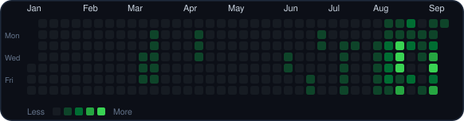
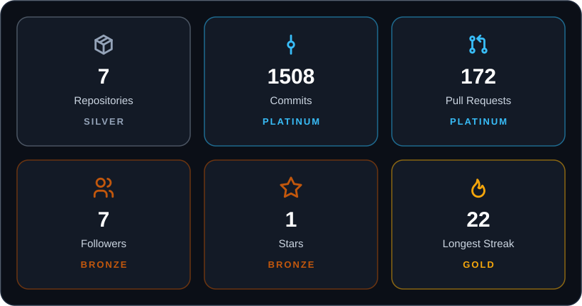

<!-- Ultra-Premium Engineering Dashboard README for venusndk -->
<!-- All statistics below are generated live by .github/workflows/*.yml — see scripts/generate-dashboard.mjs -->
<!-- Trophies card: scripts/generate-trophies.mjs, icons from React Icons (Tabler) in scripts/trophy-icons.mjs -->
<!-- Section icons: Iconify API (Tabler set), tinted #38bdf8 — rendered by GitHub as regular SVG images -->

&nbsp;
&nbsp;

 

&nbsp;
&nbsp;
&nbsp;

 

##  COMMITS STATISTICS

  

---

  <picture>
    <source media="(prefers-color-scheme: dark)" srcset="./assets/github-snake-dark.svg" />
    <source media="(prefers-color-scheme: light)" srcset="./assets/github-snake.svg" />
    
  </picture>

---
##  ABOUT ME

I build **production-grade applications** across mobile, web, and backend with a relentless focus on **scalability**, **clean architecture**, and **exceptional user experience**.

---
##  ENGINEERING DASHBOARDS

  

  

---

##  TECH STACK

<table align="center">
<tr>
<th align="left" width="22%">Category</th>
<th align="left">Stack</th>
</tr>
<tr>
<td> <strong>Mobile</strong></td>
<td></td>
</tr>
<tr>
<td> <strong>Frontend</strong></td>
<td></td>
</tr>
<tr>
<td> <strong>Backend & APIs</strong></td>
<td>&nbsp;
&nbsp;
&nbsp;
</td>
</tr>
<tr>
<td> <strong>Databases</strong></td>
<td></td>
</tr>
<tr>
<td> <strong>Cloud & DevOps</strong></td>
<td></td>
</tr>
<tr>
<td> <strong>AI / ML</strong></td>
<td>&nbsp;
</td>
</tr>
</table>

---

##  LET'S CONNECT

  
  
  
  

---

I'm always glad to talk through an idea, a product, or a hard engineering problem. Contact me for support.

 <i>"Great software is built one clean commit at a time."</i>

