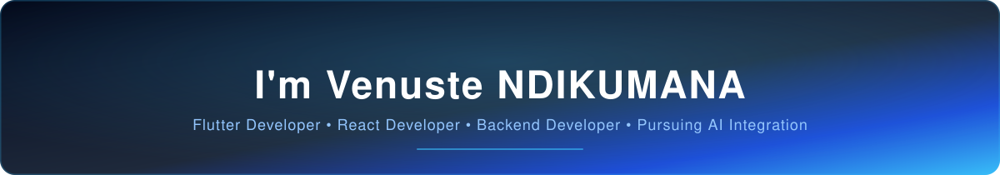

<!-- Ultra-Premium Animated GitHub Profile README for venusndk -->

<div align="center">



<br/>


<br/><br/>


</div>

<br/>

## ABOUT ME

I build **production-grade applications** across mobile, web, and backend with a relentless focus on **scalability**, **clean architecture**, and **exceptional user experience**.

```yaml
Name: Venuste Ndikumana
Role: Full-Stack & Mobile Developer
Focus: Flutter · React · Node.js · Firebase
Currently: Computer Science & Information Security Y4
Passionate About:
  - Real-time systems & offline-first architecture
  - Institutional & public-safety technology
  - AI-assisted engineering workflows
Open to: Product-focused engineering collaboration
```

---

## COMMIT STATISTICS

<p align="left">
  
  
</p>

<p align="left">
  
</p>

<p align="left">
  
  
</p>

---

## ENGINEERING DASHBOARD

<p align="center">
  
</p>

<p align="center">
  
</p>

<p align="center">
  
</p>

---

## TECH STUCK

<table align="center">
<tr>
<th align="left" width="18%">Category</th>
<th align="left">Stack</th>
</tr>
<tr>
<td><strong>Mobile</strong></td>
<td></td>
</tr>
<tr>
<td><strong>Frontend</strong></td>
<td></td>
</tr>
<tr>
<td><strong>Backend & APIs</strong></td>
<td>&nbsp;
&nbsp;
&nbsp;
</td>
</tr>
<tr>
<td><strong>Databases</strong></td>
<td></td>
</tr>
<tr>
<td><strong>Cloud & DevOps</strong></td>
<td></td>
</tr>
<tr>
<td><strong>AI / ML</strong></td>
<td>&nbsp;
</td>
</tr>
</table>

---
## LET'S CONNECT

<p align="center">
  <a href="https://www.linkedin.com/in/venus-dev-985b4928a/" aria-label="LinkedIn">
    
  </a>
  <a href="https://portfolio-xlzv.onrender.com/" aria-label="Portfolio">
    
  </a>
  <a href="mailto:venustendikumana2003@gmail.com" aria-label="Email">
    
  </a>
  <a href="https://github.com/venusndk" aria-label="GitHub">
    
  </a>
</p>

<p align="center"><i> "Great software is built one clean commit at a time."</i></p>


